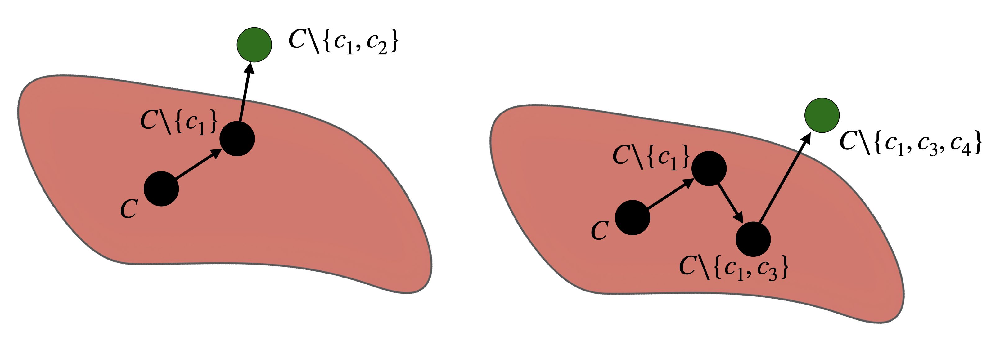
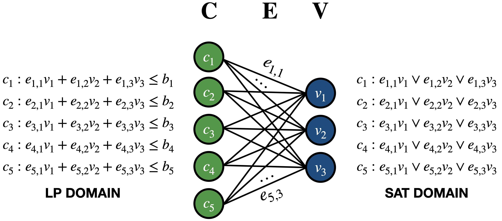
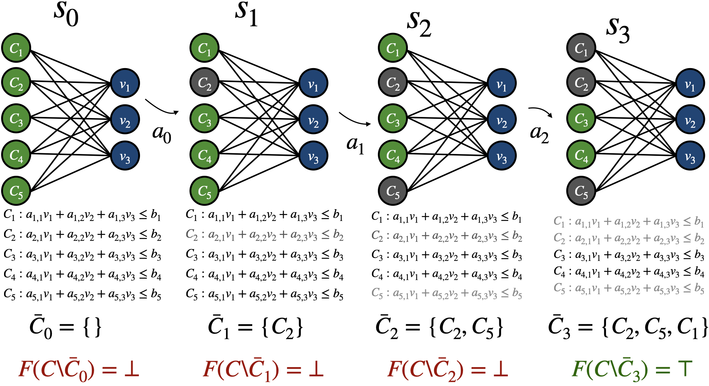
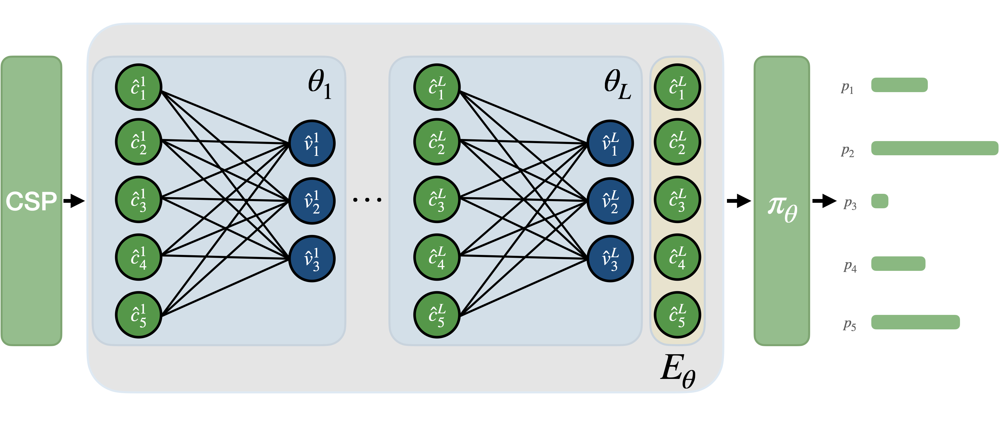

# Learning to Repair Infeasible∗ Problems with Deep Reinforcement Learning on Graphs

> Accepted at the 19th Learning and Intelligent Optimization Conference (LION 19)

This repository contains the official code and resources for the paper **"Learning to Repair Infeasible∗ Problems with Deep Reinforcement Learning on Graphs"**, presented at LION 19.

## Overview

This work explores infeasible problems. It focuses on using deep reinforcement learning (DRL) not to solve a given problem, but to repair infeasible problem instances. Indeed, some constraint problems can become infeasible due to contradictory or inconsistent constraints. We use bipartite graph neural networks to represent the interactions among these inconsistent constraints. We use deep reinforcement learning, which is used to directly and automatically develop effective repair heuristics. To the best of our knowledge, this approach is the first step toward the automated analysis of infeasibility and the systematic repair of problematic instances from a DRL perspective.


## Key Contributions

- **We formalize the repair of a Constraint Satisfaction Problem (CSP) as a shortest path problem**.

<div align="center">
  
  <br>
  <b>Figure 1:</b> Repairing an infeasible CSP can be framed as a shortest path problem. The left solution removes only two constraints, while the one on the right leads to a longer path, requiring the removal of three.
</div>

- **We encode Constraint Satisfaction Problems (CSPs) as bipartite graphs**.

<div align="center">
  
  <br>
  <b>Figure 2:</b> Bipartite graph representation of two CSPs: Linear Feasibility Problem (LF) and Boolean Satisfiability Problem (SAT).
</div>

- **We formalize this shortest path problem as a Markov Decision Process (MDP) on graphs**.

<div align="center">
  
  <br>
  <b>Figure 3:</b> The agent's goal is to construct the smallest subset of constraints that restore the feasibility of the problem. At each step, the agent selects a constraint to remove. The agent continues until the problem becomes feasible.
</div>

- **We use Graph Neural Networks (GNNs) to learn representations of the constraints within a CSP and a DRL algorithm, Proximal Policy Optimization (PPO), to learn a repair policy in both linear and Boolean domains.**

<div align="center">
  
  <br>
  <b>Figure 4:</b> The general framework of applying GNNs policy to repair CSP involves converting the problem into a bipartite graph. Each pair of node and edge in the graph is assigned an initial embedding, which is iteratively updated through a message passing process. Finally, the policy outputs a score for each constraint.
</div>

## Running Experiments

First clone the repo and install requirements:
```bash 
git clone https://github.com/MehdiZouitine/Learning_to_repair_infeasible_problems_with_DRL_and_GNN
cd Learning_to_repair_infeasible_problems_with_DRL_and_GNN/
pip install -e .
mkdir models
```

To train and evaluate our model, you can use the provided configuration files.

### Example

You can launch an experiment using:

```bash
# MAXFS experiments

# Running maxfs + dka + const
python train.py --env_type maxfs --gnn_architecture dka --weight const --num_envs 32 --num_steps 128 --n_cons 50 --n_var 10 --track

# Running maxfs + gcnn + const
python train.py --env_type maxfs --gnn_architecture gcnn --weight const --num_envs 32 --num_steps 128 --n_cons 50 --n_var 10 --track

# Running maxfs + dka + uniform
python train.py --env_type maxfs --gnn_architecture dka --weight uniform --num_envs 32 --num_steps 128 --n_cons 50 --n_var 10 --track

# Running maxfs + gcnn + uniform
python train.py --env_type maxfs --gnn_architecture gcnn --weight uniform --num_envs 32 --num_steps 128 --n_cons 50 --n_var 10 --track

# MAXSAT experiments

# Running maxsat + dka + const
python train.py --env_type maxsat --gnn_architecture dka --weight const --num_envs 32 --num_steps 128 --n_cons 19 --n_var 3 --k_max 3 --track

# Running maxsat + gcnn + const
python train.py --env_type maxsat --gnn_architecture gcnn --weight const --num_envs 32 --num_steps 128 --n_cons 19 --n_var 3 --k_max 3 --track

# Running maxsat + dka + uniform
python train.py --env_type maxsat --gnn_architecture dka --weight uniform --num_envs 32 --num_steps 128 --n_cons 19 --n_var 3 --k_max 3 --track

# Running maxsat + gcnn + uniform
python train.py --env_type maxsat --gnn_architecture gcnn --weight uniform --num_envs 32 --num_steps 128 --n_cons 19 --n_var 3 --k_max 3 --track

```
